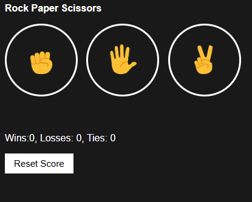
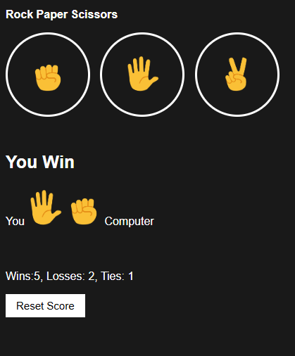

# 📚 What I Learned

## 🔹 *Functions & Parameters*
* Passing values like **'rock'**, **'paper'**, and **'scissors'** into functions  
* Using parameters to make functions reusable and clean  
* Separating logic into small, meaningful functions  

---

## 🔹 *DOM Manipulation*
* Updating text content dynamically using **JavaScript**
* Selecting elements using `document.querySelector`
* Changing UI based on game results  

---

## 🔹 *Local Storage*
* Saving game scores in **localStorage**
* Retrieving stored data after page refresh
* Making the game state persist between sessions  

---

## 🔹 *JSON*
* Using `JSON.stringify()` to store objects
* Using `JSON.parse()` to retrieve objects
* Understanding why JSON is needed for localStorage  

---

## 🔹 *Event Handling*
* Using **onclick** events to trigger game logic
* Connecting user actions to JavaScript functions
* Handling button clicks efficiently  

---

## 🔹 *Game Logic*
* Comparing user input with randomly generated computer moves
* Determining **win**, **lose**, or **draw** outcomes
* Applying conditional logic to control game flow  

---

## 🔹 *How The Game Works*
1. The player clicks on one of the buttons: **Rock**, **Paper**, or **Scissors**.  
2. The computer randomly selects one of the three moves.  
3. The game compares the player's choice with the computer's choice:  
   * **Rock beats Scissors**  
   * **Scissors beats Paper**  
   * **Paper beats Rock**  
4. The result (**win, lose, or draw**) is displayed on the page.  
5. The score is updated and saved in **localStorage**, so it persists across page refreshes.  

---

## 🔹 *Game Screenshots*

### **Game Start**

*The initial screen showing the game buttons and score.*

### **Game Result**

*After the player selects a move, the result and updated score are displayed.*

---

## 🔹 *Acknowledgements*
* Got some assistance and guidance from [Super Simple Dev](https://supersimple.dev) in creating this project  

---

### ⭐ *Overall*
* Improved problem‑solving skills  
* Better understanding of JavaScript fundamentals  
* Hands‑on experience building a complete interactive game  
